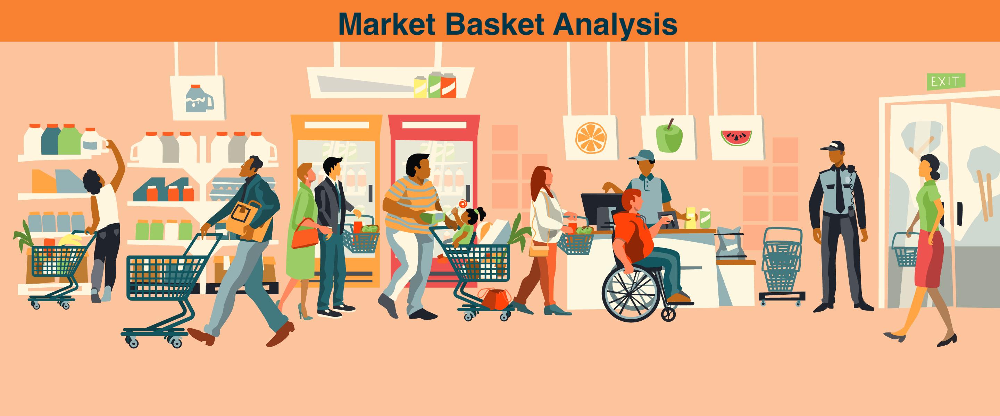

[![Contributors][contributors-shield]][contributors-url]
[![Forks][forks-shield]][forks-url]
[![Stargazers][stars-shield]][stars-url]
[![Issues][issues-shield]](https://github.com/aadimangla/Market-Basket-Optimization/issues)
[![MIT License][license-shield]][license-url]
[![LinkedIn][linkedin-shield]][linkedin-url]


<!-- PROJECT LOGO -->
<br />
<p align="center">
   <a href="">
    
  </a> 

  <h1 align="center">Market Basket Optimization</h1>

  <p align="center">
    <!-- An awesome README template to jumpstart your projects! -->
    <br />
<!--     <a href=""><strong>Explore the docs »</strong></a> -->
    <br />
    <br />
    <!--<a href="">View Demo</a>
    ·
    <a href="">Report Bug</a>
    · -->
    <a href="https://github.com/aadimangla/Market-Basket-Optimization/issues">Request Feature</a>
  </p>
</p>


---
<!-- TABLE OF CONTENTS -->
## Table of Contents

* [About the Project](#about-the-project)
  * [Built With](#built-with)
* [Getting Started](#getting-started)
  * [Prerequisites](#prerequisites)
* [Usage](#usage)
* [Roadmap](#roadmap)
* [Contributing](#contributing)
* [License](#license)
* [Contact](#contact)
* [Acknowledgements](#acknowledgements)

---

<!-- ABOUT THE PROJECT -->
## About The Project
### Market-Basket-Analysis
Using Apriori Algorithm to do Market Basket Analysis of Customers purchasing behaviours. It can predict what the customer is going to buy next by looking at the products he is buying.

Market Basket Analysis
What is it?
Market Basket Analysis is a modelling technique based upon the theory that if you buy a certain group of items, you are more (or less) likely to buy another group of items. For example, if you are in an English pub and you buy a pint of beer and don't buy a bar meal, you are more likely to buy crisps (US. chips) at the same time than somebody who didn't buy beer.

The set of items a customer buys is referred to as an itemset, and market basket analysis seeks to find relationships between purchases.

Typically the relationship will be in the form of a rule:

IF {beer, no bar meal} THEN {crisps}. The probability that a customer will buy beer without a bar meal (i.e. that the antecedent is true) is referred to as the support for the rule. The conditional probability that a customer will purchase crisps is referred to as the confidence. The algorithms for performing market basket analysis are fairly straightforward (Berry and Linhoff is a reasonable introductory resource for this). The complexities mainly arise in exploiting taxonomies, avoiding combinatorial explosions (a supermarket may stock 10,000 or more line items), and dealing with the large amounts of transaction data that may be available.

A major difficulty is that a large number of the rules found may be trivial for anyone familiar with the business. Although the volume of data has been reduced, we are still asking the user to find a needle in a haystack. Requiring rules to have a high minimum support level and a high confidence level risks missing any exploitable result we might have found. One partial solution to this problem is differential market basket analysis, as described below.

### How is it used?
In retailing, most purchases are bought on impulse. Market basket analysis gives clues as to what a customer might have bought if the idea had occurred to them . (For some real insights into consumer behavior, see Why We Buy: The Science of Shopping by Paco Underhill.)

As a first step, therefore, market basket analysis can be used in deciding the location and promotion of goods inside a store. If, as has been observed, purchasers of Barbie dolls have are more likely to buy candy, then high-margin candy can be placed near to the Barbie doll display. Customers who would have bought candy with their Barbie dolls had they thought of it will now be suitably tempted.

But this is only the first level of analysis. Differential market basket analysis can find interesting results and can also eliminate the problem of a potentially high volume of trivial results.

In differential analysis, we compare results between different stores, between customers in different demographic groups, between different days of the week, different seasons of the year, etc.

If we observe that a rule holds in one store, but not in any other (or does not hold in one store, but holds in all others), then we know that there is something interesting about that store. Perhaps its clientele are different, or perhaps it has organized its displays in a novel and more lucrative way. Investigating such differences may yield useful insights which will improve company sales.

### Dataset
You can get the dataset using this [link](https://www.kaggle.com/roshansharma/market-basket-optimization)

### Built With
This was build using following frameworks, libraries and softwares.
* [Numpy](https://numpy.org/)
* [Pandas](https://pandas.pydata.org/)
* [Matplotlib](https://matplotlib.org/)
---
<!-- GETTING STARTED -->
## Getting Started

To run this project you need to follow the following steps.

### Prerequisites

These are the prerequisites you need to build this bot as well as run it.

```sh
cmd:\ pip install numpy
cmd:\ pip install pandas
cmd:\ pip install matplotlib
```
#### Extra SETUP
- Create conda environment and create project in this environment
- After installing requirements in above Modules LIST
- You need python idle such as Jupyter notebook or spyder


---
<!-- USAGE EXAMPLES -->
## Usage
Although Market Basket Analysis conjures up pictures of shopping carts and supermarket shoppers, it is important to realize that there are many other areas in which it can be applied. These include:
 
* Analysis of credit card purchases
* Analysis of telephone calling patterns
* Identification of fraudulent medical insurance claims
* Providing Better Product Analytics
* Monitoring Market Research
* Analysis of telecom service purchases

Note that despite the terminology, there is no requirement for all the items to be purchased at the same time. The algorithms can be adapted to look at a sequence of purchases (or events) spread out over time. A predictive market basket analysis can be used to identify sets of item purchases (or events) that generally occur in sequence — something of interest to direct marketers, criminologists and many others.

---

<!-- ROADMAP -->
## Roadmap

See the [open issues](https://github.com/aadimangla/Market-Basket-Optimization/issues) for a list of proposed features (and known issues).


---
<!-- CONTRIBUTING -->
## Contributing

Contributions are what make the open source community such an amazing place to be learn, inspire, and create. Any contributions you make are **greatly appreciated**.

1. Fork the Project
2. Create your Feature Branch (`git checkout -b feature/AmazingFeature`)
3. Commit your Changes (`git commit -m 'Add some AmazingFeature'`)
4. Push to the Branch (`git push origin feature/AmazingFeature`)
5. Open a Pull Request

---

<!-- LICENSE -->


## License

[](http://badges.mit-license.org)

- **[MIT license](http://opensource.org/licenses/mit-license.php)**
- Copyright 2020 © <a href="http://adityamangla.com" target="_blank">Aditya Mangla</a>.

---

<!-- CONTACT -->
## Contact

Aditya Mangla - [@aadimangla](https://twitter.com/aadimangla) - aadimangla@gmail.com - [adityamangla.com](http://www.adityamangla.com/index.html)

Project Link: [https://github.com/aadimangla/Market-Basket-Optimization](https://github.com/aadimangla/Market-Basket-Optimization)

---

<!-- ACKNOWLEDGEMENTS -->
## Acknowledgements
* [Numpy](https://numpy.org/)
* [Pandas](https://pandas.pydata.org/)
* [Matplotlib](https://matplotlib.org/)


<!-- MARKDOWN LINKS & IMAGES -->
<!-- https://www.markdownguide.org/basic-syntax/#reference-style-links -->
[contributors-shield]: https://img.shields.io/github/contributors/aadimangla/Market-Basket-Optimization.svg?style=flat-square
[contributors-url]: https://github.com/aadimangla/Market-Basket-Optimization/graphs/contributors
[forks-shield]: https://img.shields.io/github/forks/aadimangla/Market-Basket-Optimization.svg?style=flat-square
[forks-url]: https://github.com/aadimangla/Market-Basket-Optimization/network/members
[stars-shield]: https://img.shields.io/github/stars/aadimangla/Market-Basket-Optimization.svg?style=flat-square
[stars-url]: https://github.com/aadimangla/Market-Basket-Optimization/stargazers
[issues-shield]: https://img.shields.io/github/issues/aadimangla/Market-Basket-Optimization.svg?style=flat-square
[issues-url]: https://github.com/aadimangla/Market-Basket-Optimization/issues
[license-shield]: https://img.shields.io/github/license/aadimangla/Market-Basket-Optimization.svg?style=flat-square
[license-url]: https://github.com/aadimangla/Market-Basket-Optimization/blob/master/LICENSE.txt
[linkedin-shield]: https://img.shields.io/badge/-LinkedIn-black.svg?style=flat-square&logo=linkedin&colorB=555
[linkedin-url]: https://linkedin.com/in/aadimangla
[product-screenshot]: images/screenshot.png
